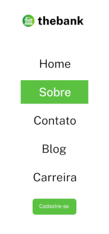
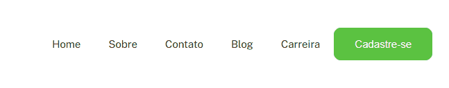
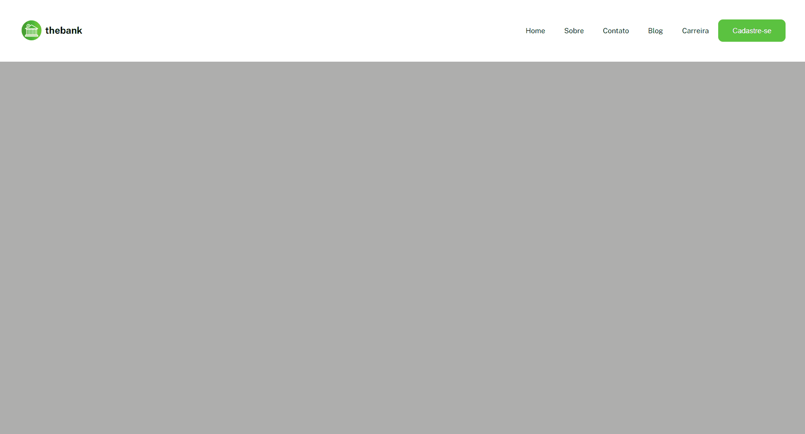

# DevQuest - Desafio Menu Flexbox

## Bem vindo! 👋

Esse é o meu desafio do curso [DevQuest](https://devemdobro.com/matriculas-abertas/) sobre montar um Menu Responsivo.

### Desafio proposto!
Usar os conhecimentos adquiridos no módulo de CSS Avançado - Flexbox pra resolvê-lo da melhor forma.

### Resultado!

## Conhecimentos adquiridos!

Durante o desafio, pude perceber como podemos utilizar a tag de listas facilmente para criar um menu de navegações no HTML. No CSS, todo meu layout está baseada em flexbox, onde foi separada, centralizado e estilizado cada um dos meus elementos.

**Obrigado pela sua atenção!**